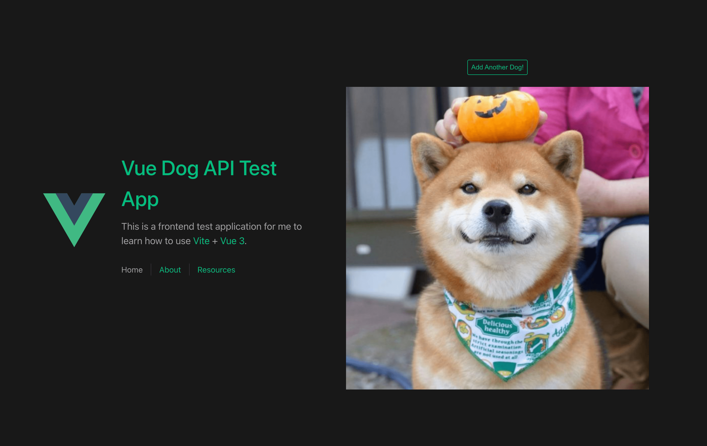

# vue-dog-api

This is a frontend test application for me to learn how to use Vite + Vue 3.

https://harryli0088.github.io/vue-dog-api/



## Recommended IDE Setup

[VSCode](https://code.visualstudio.com/) + [Volar](https://marketplace.visualstudio.com/items?itemName=Vue.volar) (and disable Vetur) + [TypeScript Vue Plugin (Volar)](https://marketplace.visualstudio.com/items?itemName=Vue.vscode-typescript-vue-plugin).

## Type Support for `.vue` Imports in TS

TypeScript cannot handle type information for `.vue` imports by default, so we replace the `tsc` CLI with `vue-tsc` for type checking. In editors, we need [TypeScript Vue Plugin (Volar)](https://marketplace.visualstudio.com/items?itemName=Vue.vscode-typescript-vue-plugin) to make the TypeScript language service aware of `.vue` types.

If the standalone TypeScript plugin doesn't feel fast enough to you, Volar has also implemented a [Take Over Mode](https://github.com/johnsoncodehk/volar/discussions/471#discussioncomment-1361669) that is more performant. You can enable it by the following steps:

1. Disable the built-in TypeScript Extension
    1) Run `Extensions: Show Built-in Extensions` from VSCode's command palette
    2) Find `TypeScript and JavaScript Language Features`, right click and select `Disable (Workspace)`
2. Reload the VSCode window by running `Developer: Reload Window` from the command palette.

## Customize configuration

See [Vite Configuration Reference](https://vitejs.dev/config/).

## Project Setup

```sh
npm install
```

### Compile and Hot-Reload for Development

```sh
npm run dev
```

### Type-Check, Compile and Minify for Production

```sh
npm run build
```

### Run Unit Tests with [Vitest](https://vitest.dev/)

```sh
npm run test:unit
```

### Run End-to-End Tests with [Cypress](https://www.cypress.io/)

```sh
npm run build
npm run test:e2e # or `npm run test:e2e:ci` for headless testing
```

### Lint with [ESLint](https://eslint.org/)

```sh
npm run lint
```

## GitHub Pages Setup

Install `gh-pages`
```
npm i -D gh-pages
```

Edit `vite.config.ts`:
```.ts
export default defineConfig({
  base: process.env.NODE_ENV === 'production' ? '/vue-dog-api/' : '/'
});
```
Something dumb I found is that `vue.config.js` is not acutally picked up by vite during the build process, so don't bother trying to use `publicPath`

Edit `package.json`:
```.json
{
    "scripts": {
        "deploy": "npm run build && npx gh-pages -d dist -t true"
    }
}
```

Run the deploy script:
```
npm run deploy
```